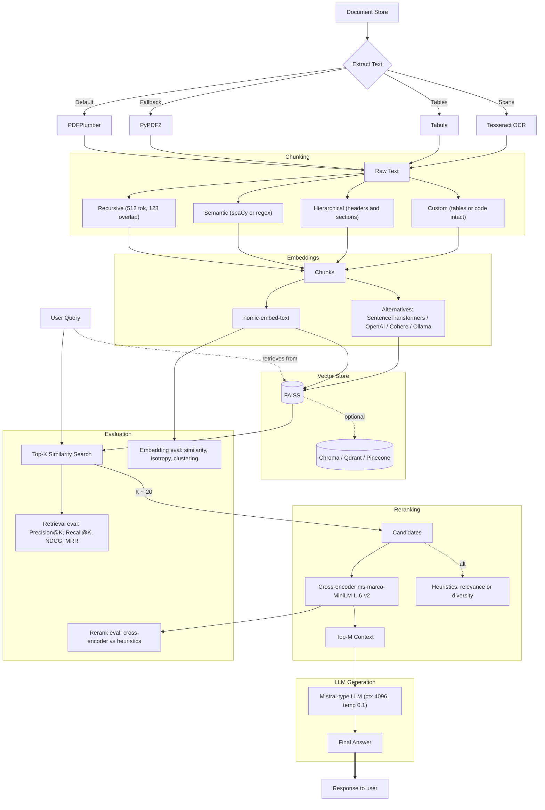
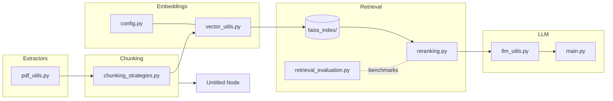

# KnowledgeSmith: Retrieval-Augmented Generation (RAG) Pipeline for Documents

A production-ready **RAG pipeline** implementation designed for document ingestion, chunking, embedding, storage, retrieval, and contextual LLM-powered response generation. Built with modularity and scalability in mind, this codebase balances performance, accuracy, and cost-efficiency.

NOTE: This project is work in progress.

---

## 📖 Overview

This repository provides:

* Document ingestion with robust text extraction.
* Multiple chunking strategies for different document types.
* High-quality embeddings using state-of-the-art models.
* Fast vector search with FAISS and optional alternatives.
* Cross-encoder reranking for improved retrieval quality.
* Integration with Mistral-type LLMs for stable, factual outputs.
* Built-in evaluation suite for embeddings, retrieval, and reranking.

---

## 🔑 Features

* **PDF/Text Extraction**:

  * `PDFPlumber` (default) for accurate extraction.
  * Fallbacks: `PyPDF2`, `Tabula` (tables), and `Tesseract OCR` (scanned PDFs).

* **Chunking Strategies**:

  * Recursive (default: 512 tokens, 128 overlap).
  * Semantic (spaCy sentence segmentation).
  * Hierarchical (headers/sections).
  * Custom (tables, code blocks preserved).

* **Embeddings**:

  * Default: `nomic-embed-text` (768-dim, semantic quality).
  * Alternatives: SentenceTransformers, OpenAI (`ada-002`), Cohere (`embed-multilingual-v2.0`), Ollama embeddings.

* **Vector Stores**:

  * Default: FAISS (efficient, sub-50ms retrieval for 100K+ vectors).
  * Alternatives: Chroma, Qdrant, Pinecone.

* **Re-ranking**:

  * Default: Cross-encoder `ms-marco-MiniLM-L-6-v2`.
  * Alternatives: heuristic-based relevance or diversity rerankers.

* **LLM Integration**:

  * Default: Mistral-type model (4096-token context, temperature 0.1).
  * Alternatives: Ollama local models, OpenAI chat models.

* **Evaluation Suite**:

  * Embedding metrics: similarity, isotropy, clustering, alignment.
  * Retrieval metrics: Precision\@K, Recall\@K, NDCG, MRR.
  * Reranking evaluation: cross-encoder vs heuristics.

---

## 📊 Default Stack Summary

* **Extraction** → PDFPlumber
* **Chunking** → Recursive (512 tokens, 128 overlap)
* **Embeddings** → `nomic-embed-text`
* **Vector Store** → FAISS
* **Re-ranking** → `ms-marco-MiniLM-L-6-v2`
* **LLM** → Mistral-type (low temperature, long context)

---

## 🚀 Use Cases

* Document Q\&A over PDFs, reports, or technical manuals.
* Enterprise knowledge retrieval and search augmentation.
* Prototyping modular RAG architectures for research and production.

---

## 🛠️ Installation

```bash
# Clone the repository
git clone https://github.com/your-org/rag-pipeline.git
cd rag-pipeline

# Install dependencies
pip install -r requirements.txt
```

Optional installs for extended functionality:

```bash
# For Semantic Chunking
pip install spacy
python -m spacy download en_core_web_sm

# For OCR support
sudo apt-get install tesseract-ocr
pip install pillow

# For Tabula (tables)
java -jar tabula.jar
```

---

🗺️ Pipeline Diagram (Mermaid)



---

🔗 File-to-Stage Map

## 📂 Project Structure

```
PDF_RAG/
├── faiss_index/ # Persisted FAISS artifacts (index, IDs, metadata)
├── chunking_strategies.py # Recursive/Semantic/Hierarchical/Custom chunkers
├── config.py # Central configuration (paths, model names, params)
├── embedding_comparison.py # Embedding A/B tests and reports
├── faiss_index_metadata.json # Index metadata (dims, metric, doc map)
├── FLOW.md # Model references for end‑to‑end flow
├── JUSTIFICATIONS.md # Parameter justifications and design notes
├── llm_utils.py # LLM wrapper (Mistral/Ollama/OpenAI), prompts, decoding
├── main.py # Pipeline entry point (ingest + query CLI)
├── MODELS.md # Catalog of supported models and options
├── NOTES.md # Dev notes and scratch decisions
├── pdf_utils.py # PDF extractors (PDFPlumber, PyPDF2, Tabula, OCR)
├── requirements.txt # Python dependencies
├── reranking.py # Cross‑encoder and heuristic rerankers
├── retrieval_evaluation.py # Precision@K, Recall@K, NDCG, MRR evaluation
├── tests.ipynb # Notebook for quick manual tests
└── vector_utils.py # Embedding + FAISS utilities (build/search/persist)
```

---

## 📜 License

MIT License – free to use, modify, and distribute.

---

## 🤝 Contributing

Contributions are welcome! Please open an issue or submit a PR with improvements.

---

## ⭐ Acknowledgements

* [FAISS](https://github.com/facebookresearch/faiss)
* [SentenceTransformers](https://www.sbert.net/)
* [Mistral](https://mistral.ai/)
* [Cohere](https://cohere.ai/)
* [OpenAI](https://openai.com/)
* [Ollama](https://ollama.ai/)

---
